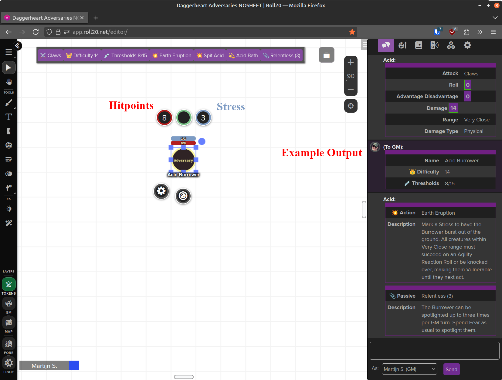

# Daggerheart-Roll20
Helpers for playing Daggerheart on Roll20. 


# Daggerheart-Adversaries-Template.js
This is a temporary solution to support Daggerheart Adversaries in Roll20 until the demiplane-roll20 integration supports Adversaries.
See https://app.roll20.net/forum/permalink/12368573/ and https://app.roll20.net/forum/permalink/12408912/ .

This solution is intended to comply with the Darrington Press Community Gaming License (https://darringtonpress.com/wp-content/uploads/2025/06/DPCGL-June-26-2025.pdf), but i am no lawyer.

Step 1: Create a game with **no** character sheet using the default sandbox. 
_This is needed because of a bug in setDefaultToken in the experimental sandbox_

Step 2: Obtains a copy of https://github.com/seansbox/daggerheart-srd/blob/main/.build/json/adversaries.json

Step 3: Open Daggerheart-Adversaries-Template.js in a code editor and insert the content of above json in the line 

```const adversaries = [];```

Line 192 abouthish, almost at the bottome of the file.

Step 4: Upload Daggerheart-Adversaries-Template.js in your game.

Step 5: Open the Roll20 game and enter in chat

```!dgha --create```

The mod now creates all srd adversaries as characters. 
Characters are filled with attributes and abilities with inspiration by https://www.youtube.com/watch?v=nreo4xyZQE4.
A default image is used as avatar and default token (ugly token image created by me).

Step 6: manually drop images in the avatars of the adversaries/npcs. Do not fill the token, as the mod overwrites the tokens with the avatar image and adversary info.
_As I do not own right on images, you need to bring your own._

Step 7: run mod to update the tokens.

```!dgha --create```

Step 8: Transmogrify the used adversaries into your play game

This how the Adversary will look like 



Not perfect, but good enough to survive until rhe demiplane-roll20 integration catches up.
